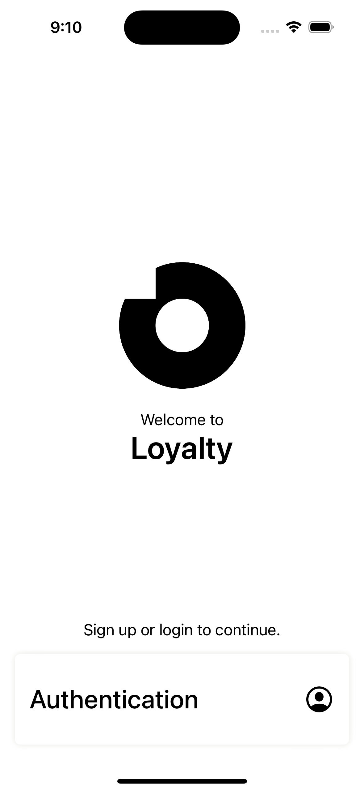
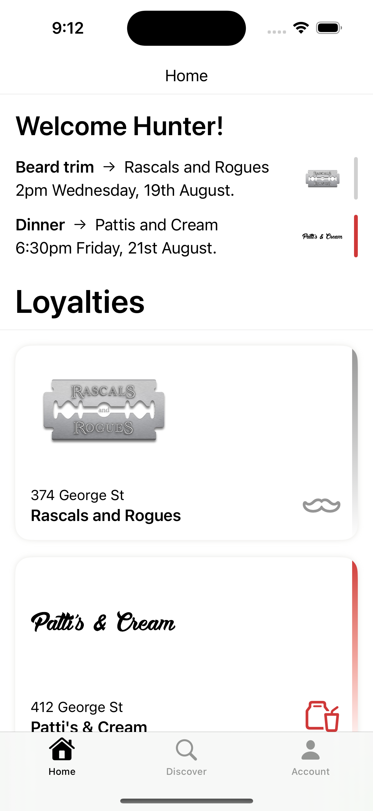
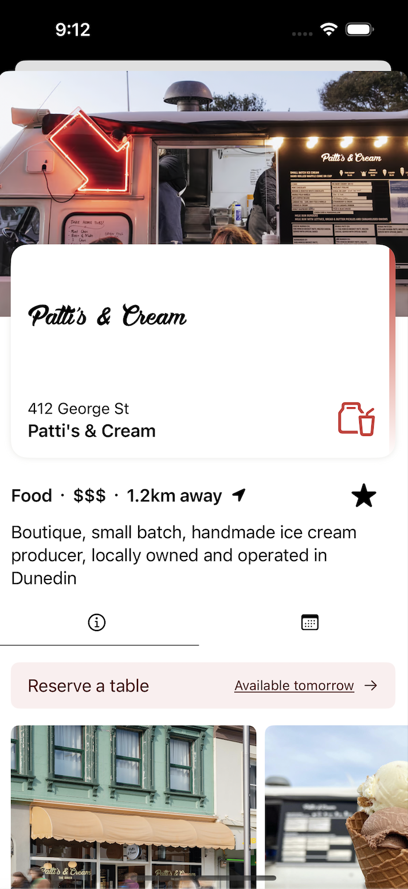

# Loyalty (iOS App) 📱

  

## Generating new files after an API update ⛓️

Loyalty fetches data via a GraphQL endpoint - this endpoint is frequently updating.
To enable local development, the project needs to have up-to-date schema files generated.  

1. Ensure you have the Apollo CLI installed
    - In Xcode, right-click `LoyaltyApp` project in the side bar, select `Install CLI`
2. Autogenerate the supporting swift files for the schema
    - **Before running this script, delete any existing `Autogen` folder in the `LoyaltyApp/GraphQL` folder!**
    - In CLI, run the autogen script by entering `./autogen-schema`
3. Add the files to Xcode
    - In Xcode, right-click the `LoyaltyApp/GraphQL` folder and select "Add files to LoyaltyApp..." 
    - Click the `Autogen` folder and press the "Add" button 
